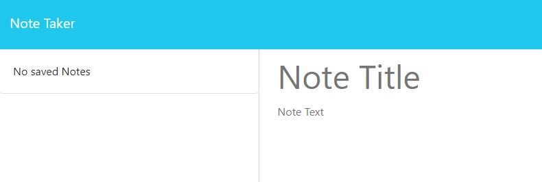

# Note Taker

## Description
An application to allow you to take quick notes and save them down. You can also delete notes that you no longer need.

## Table of Contents
 - [Note Taker](#note-taker)
 - [Description](#description)
 - [Installation Instructions](#installation-instructions)
 - [Usage Information](#usage-information)
 - [License](#license)
 - [Contribution Guidelines](#contribution-guidelines)
 - [Testing Instructions](#testing-instructions)
 - [Questions?](#questions)

## Questions?
- Github: https://github.com/lunchtimewhee 
- Email: anthonyrli1994@gmail.com

## Installation Instructions
1. Clone from the repository https://github.com/lunchtimewhee/Note-Taker/

2. Start up the server by running node server.js

3. Open the website at localhost:3001

## License

## Usage Information
1. Deleting an existing note:
[]

[]

2. Creating a new note:
[]

[]

## Contribution Guidelines
Please reach out to Anthony at the listed contact methods.

## Testing Instructions
N/A

